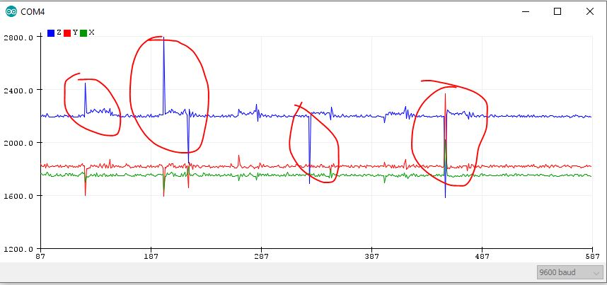

# ECE 16 Grand Challenge
By: Anwar Hsu A15443752

Date: 03/18/2020

## Document Potential Failure Points:

### Problems of tap detection 

>1. We are not allowed to move our accelerometer and has to stay flat on a table. This is caused because in our code, we are assuming the thresholds are stationary. If we were to physically raise our accelerometer upwards, it would read a tap as any movement pass its threshold would count as a tap. 

>2. Orienting our accelerometer backwards would also cause an error. This is because once we flip our accelerometer, it would drop of z axis baseline values and the tap peaks would never cross the originial threshold values. 

>3. We are assuming everyone has similar tap strength. In our code, we have a stationary threshold thats works well for only me. If I were to ask somone with a weaker tap strength than me, there peaks might not be able to reach my thresholds and thus can't count the correct ammount of taps. 

### Problems of Heart rate detection

> 1. We are assuming we have a perfect 10sec sample of data. This means that if we have any error such as an extra heartbeat or noisy data, our heartrate detection will not work correctlty. For my heartrate detection algorithm, I found the beats in 10 sec and multiply by 6 to get the BPM. If in this 10 sec sample had an extra count, it would make our caculcation off by a factor of 6 or even worse depending on the 10 sec frame. 

> 2. There is a hardware issue where I must aline my finger where my blood vessel is directly on top of the pulse sensor that could give bad readings. There other factors such as too much pressure on the sensor which can cut bloodflow or if you were to be sweaty there might be a slight layer of water vapor on your fingers which could lead to inaccurate readings from the IR pulse sensor. 

> 3. A personal problem I had was not being able to obtain 50hz for my sampling speed. After modifications on ardiuno and some optimzation from the TA's I wasn't able to fix this issue as I was getting around 45hz max. This is probably caused through my computer hardware or software from a windows machine because another sudent had a similar problem to me and he had windows as well. Having a different sampling speed sets up problems, espcially for our GMM machine learning alg.This is an issues for our GMM model explored in lab 5 as my offset sampling speed could cause false training data as the samples are different compared to the other subjects data and thus bad prediction for heartrate thresholds.

### Choose your Challenge:
I will be exploring the challenge on where our tap detection algorithm wouldn't work if we flip our accelerometer upsidedown. 

> The reason I will try and fix this issue is because in the real world of smart watches, the orientation of the watch dosen't matter whether its heartrate or touch screen tap detection. An apple watch would dectect any taps whether your upside or running. Adding a upside down feature to our "smart watch" will add more realistic functionality to my tap rate detection algorithm and possibliy set me up for creative engineering solutions to other future problems.   

> 
> we can see how our tap algorithm works in a sense that theres a peak when we tap. The way we appoarch this is that we would create a thresold for the negative and postive peaks it would count when it detects our peaks

> 
> We can see the difference in the dc value of the blue(Z axis) graph for our downards orientation accelerometer. The idea of having a threshold is similar to having a positive orienation in a sense that when we tap, there will be peaks. However, we see that it starts aound 1500 rather than 2200 as the dc values are different

>
> As we can see with our current algorithm the threshold is shown with the red line. We see that taps ouccur within each oscilating peak. We also see that the peaks never cross the threshold and thus we are not able to detect any taps. 

### Implement the Solution

> Solution: I use a similar idea as checking for taps for the upwards orientation for the downwards orientation. I first check too see what orientation the accelerometer is at. Knowing that the baseline dc value changes depending on orientation. I have determine if the dc value range from 2200 for the z axis its facing upwards and if the dc value is aroud 1400 then its facing downards. Once my code understands what orientation my accelerometer is at. I had respected threshold values based on what orientation state its at. Once I tap regardless of orientation, once the peak reaches pass the threshold value it, the machine detects the tap and I have printed on my serial monitor "A tap has been detected" to prove that it works(can't use OLED screen since my breadboard is facing downards and you cant see it). 

>
> This is a close up shot of what the upwards orientation would look like once a peak passes the threshold. 

>
> Working proof of upwpards orientation

>
> Working proof of downards orientation

### Demo 
https://www.youtube.com/watch?v=ROuRpKwhj7E

