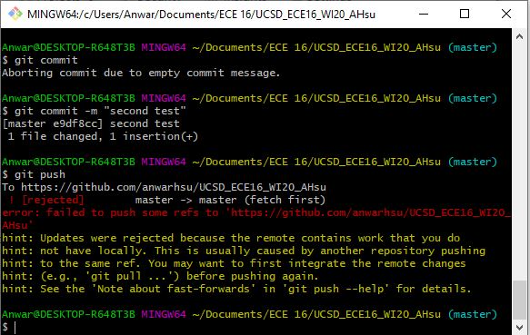
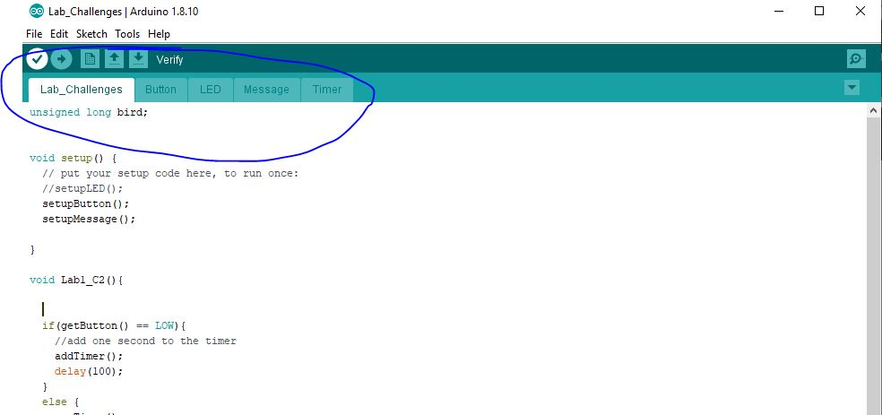

# ECE 16 Lab 1 report 
By: Anwar Hsu A15443752

Date: 01/06/2020

## Tutorial:

### Tutorial Digital Write:
> Q. What is the frequency of the blink rate in this example? Note that frequency is the inverse of the time it takes for a cycle. A cycle is the time it takes to go HIGH to LOW to HIGH again. Record a video of your FireBeetle blinking.  Make a note of the answer for now, in the next GIT tutorial, you will get a copy of a sample lab report.

> A. It takes 1.5 sec to make a cycle(period) go from HIGH to LOW to HIGH. If we take the inverse of the period we get the frequency, which will give us 2/3 hz or .66667 hz. 
>
>

### Tutorial GIT Basics:

> Q. When you open the conflicted readme, what did you get? How did you fix it?

> A. I fix it by pulling first, edit the changes I want, add, commit and push(In that order)
>
> 

### Tutorial LED:

> Q. Why do we need a pull-up resistor? Describe the behavior without it.

> A. We need to differeniate 0's and 1's by having a defined voltage differnece. When the switch is open. THe output is connected to vin with the pull resistor giving an output with 1's. When the switch is closed, the output connected to ground giving the output a 0's. If there isn't a pull up resistor, the computer will be confused as their isn't a define difference in voltage and thus could read differently on what is a 1 and 0. 

> Q. Which GPIO pin did you have to use according to the above setup?

> A. the IO is pin 26 

> Q. What is the expected current draw?

> A. ohms law is V=IR. If we solve for I we got about 0.015A or 15 mA

> Q. What is the limit for the GPIO? You can find this on the ESP32_WROOM datasheet: https://www.espressif.com/sites/default/files/documentation/esp32-wroom-32_datasheet_en.pdf . Look under IOH.

> A. The max current allowed for the input/output ports is 1,100mA

### Tutorial Serial Write:
 > Q. In your report, run the above code at Baud Rate of 9600. How many seconds are between each Hello World? What did you expect the time between each print statement to be and what did you actually get? 

 > A. Theres about 0.007s between each Hello world output. The expected time between is suppose to be around 0.001s. The cause to this slight delay is caused by the small delay the machine reads each line of code and time it takes to output each message. 

> Q. How does this change when you change the baud rate to 2400, 4800, and 115200. (When you change the baud rate, you’ll also need to change the Serial Monitor’s Baud Rate. The answer to this question should be quantitative and not just qualitative.  Remember that baud rate refers to how many bytes per second is sent. Remember that an ASCII character is 8 bits. 

> A. if we change the baud rate, we get gibberish in terms of outputing something not even close to the message "hello world." This is caused because if the machine is reading the data sent from the MCU at a different rate, this causes the machine to reading a different set of binary 1's and 0's. The computer then outputs the ASCII characters and since the machine read a complete differrent set of bits, it causes a completly differnet output. For example, if we want the letter B to be output, the machine needs to read 01000010 in binary. If the machine is off by one value and reads 01000001. The output would be A. Thus we need to keep the baund rate conisistent or else our output will be different than expected. 

### Tutorial Creating New Project File:
> Q. Note the tabs shown in the figure (for Button, LED, Message, and Timer), please make these four tabs.

> A. 
## Challenges:

### Challenge 1: LED Blink Frequency
The goal of this challenge is to create 6 conditions that all have different frequencies and delays. the initalize setup is given so all I did was code the methods for each of the conditions.

> Q. What are the resistor values you chose for each of the LEDs?

> A. For the red resistor, I use the 220 ohm resistor because the previous tutorial recommend it. For the yellow resitors, I use the same 220ohm resitor becuase red and yellow have very similar voltage drops (they differnt by a factor of 0.1 v). As for the blue LED. the voltage socure can't supply the 3.6 to 3.8 voltage drop for the blue LED, however, their is a built in tolerance that will allow it to turn on even if the requierments wern't met. So I put a very low resistor (100ohm) to control the current

> Q. Videos showing each condition (please record in landscape-horizontal mode)

>  
>
> Note: The gif verision dosen't really show the blue LED blink, however, theres a frame in this GIF where we get a glimpse of this blink

### Challenge 2:Timer - Part 1

> Q. What is the average time elapsed for each second increment? Use millis() to help you with this task. Describe how you measured this.  

> A. The average time per second increment is 1000ms which is about one sec. This makes sense because there is a one second delay in the challenge 2 code. 

### Challenge 3: Timer - Part 2

> Q. Describe in plain english the logic of your program.

> A. We first initalize what the IO pins are. We then declare what is define as an input and output. (i.e the button is our input and the LED is our output). Next we create our challenge 2 function which increments the timer by one sec when you hold down the button. Once you let go of the button, the runTimer function then increments the timer downards til it reaches zero. This program is basically a timer that adds time when you hold down the button and starts counting down to zero once you let go of this button.   