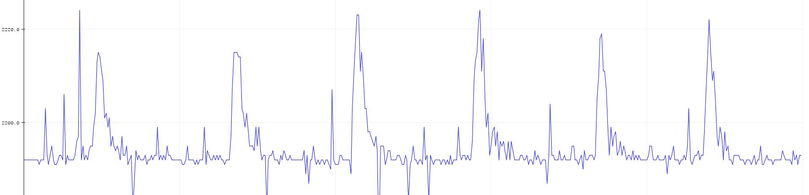
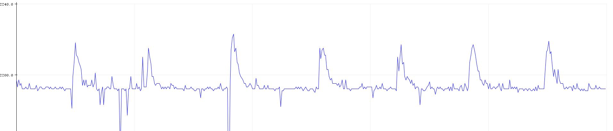
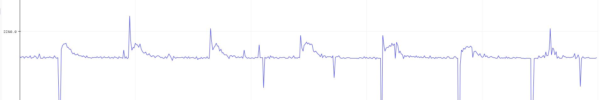

# ECE 16 Lab 2 report 
By: Anwar Hsu A15443752

Date: 01/06/2020

## Tutorial: 

### Tutorial Accelerometers:
> Q. How many bits is your ADC? Try connecting your A0 pin to 3.3V. How did you calculate the bits?

> A. If, we connect our A0 pin to 3.3V we get 4090. 2^x = 4090, where x = 12. Therefore there is 12 bits

> Q. What is the resting value of the accelerometer when it is laying face up. Why is it not 0? What is this value in terms of volts (remember that 3.3V is the maximum).

> A. about 2190. Which is about half of 5 volts. This is caused because there needs to be an offset since when we shake the acceleromter, the force can be applied downards, yet we aren't allowed to get a negative voltgae reading. This offset, allows us to always get a positive voltage reading even if the force applied is going downwards. 

> Q. Tap the accelerometer light, medium, and hard. What is the average value of each tap? How did you calculate this? Please don’t ask us if you are tapping correctly, use your judgement :) Show a screenshot of the accelerometer plotting and tapping at different strengths.

> A. For light the peaks is around 2220, for medium its around 2230, for hard its around 2250. The baseline for the the accelerometer is at rest is 2190. If we subtract the peak- baseline we get half the amplitude which gives us the average value of each ta.p. For light its 2220-2190 = 30. For medium its 2230 - 2190 = 40. For hard its 2250 - 2190 = 50

>Image of Light:
>Image of Medium: 
>Image of Hard 

### Tutorial Pulse Width Modulation:
> Q. In the above figure, assuming we are showing 2ms of data, what is the PWM frequency?

> A. There are 5 cycles in that 2ms time frame of data. The frequency is cycles per seconds, so we get 5/2 which is 2.5mHz

> Q. Why is 100% duty cycle 255 instead of 256?

> A. The last bit is used as a on or off switch to let them computer know whether the PWM needs to on or off. Therefore we have 255 instead of 256 at 100 duty cycle.

> Q. We purposely made some mistakes in the above example.  What were they? It will not work directly, but by reading the compilation error, the tutorial instructions, and comments carefully, you should have no trouble getting it to work!

> A. In global, the variable pwmBitresolution is suppose to caplitize the R in resolution. Theres also missing semi colons after each delay in the loop portion. We also have to use the function ledcWrite instead of ledcAttach in the loop porition.  

### Tutorial OLED:
> Q. Again we made some intentional mistakes in the code above. What were they?

> A. In the main tab setup, the showMessages function is not the same as the showMessage function because of the extra s of the end. thr u8x8.bgin() is also missing a semi colon in the void initDisplay() function. Finally the void showMessage fcuntion has parameter const char * message. However, in the function it has u8x8.print(messages) which has an extra s in the end. 

### Tutorial Serial Read
> Q. What did the Arduino receive? How does this change if you use different line endings?

> A. The Arduino receives ASCII characters that I input into the Serial monitor. So hello outprinted 104 101 108 108 111 10. The code then translate that ASCII character into a int or Decimal value for each character. Depending on what the drop down option I pick, NL would give an output of 10 becuase the ASCII deciaml value of LF is 10 and CR would give a decimal value of 13. 

> Q. What are the Decimal values of NL (new line) and CR (Carriage Return)?

> A. The Decimal value of NL is 10 and the CR  value is 13. 

## Challenges 

### Challenge 1: Fading Buzzer
We had to create a digital siganl and conver that to a analog singal using the idea of PWM. Our output soucre for this challenge was a motor that buzzs from high to medium to none.  

> Q. Which pin does the code ask you to use for the motor?

> A. The pin in the code is 5

> Q. Why can’t we achieve this speed variation using a digitalWrite and instead has to use ledcWrite?

> A. We cant use digitalWrite becuase it would only give us a digital output of either high or low. We are using LedcWrite because t uses the idea of PWM to acheive a analog signal given an digital siginal. This is acheived by the frquency of the siginal and duty cycles needed. In out code we are running 

> you can visually see the different stages of buzz power as it goes from high to medium to none.  
>

### Challenge 2: Gesture Detection
We had to use an accelometer that would be use to dectet weather the user has tap on the accelerometer. We then add time and display this time onto an OLED display. 

> Q. What are some different logics you tried and why? What are some situations where you noticed your detection algorithm doesn’t work well?

> A. I only measured the z axis and use a threshold value where if value read when pushing on the accelerometer excceds this threshld value, the program will detect that push as an tap. A common problem i have is that sometimes the reactive force creates a oscilating effect where it could bounce back to the threshold and cause a double count when pressing. 

> Q. Provide a screenshot of a plot showing 5 taps and the threshold used. 

> A. The threshold I use was 2220 for the peak and 2050 for the lower peaks. I represented the red line as the high peak and yellow as the low peak. (As shown below)
>

> Q. Include a video of you tapping on the accelerometer and the OLED counting each time. 

> A. 

### Challenge 3: Read and Write to OLED
We have to input a message into a Serial input monitor. Then we have to output this message into a OLED display 

> Q. Video of a message typed into the serial monitor and appearing on the OLED. This video should be shot WITHOUT moving the camera

> A. You can see the message in the Serial input monitor and once I hit enter on the keyboard it is displyed onto the OLED display 
> 

> Q. What happens if you write a really long message? Why?

> A. It would ignore the first starting characters and display what can fit onto the scrren. This is because it is a const char pointer. This is basically an array and would only ouput the remaning characters that can fit on the screen. 

### Challenge 4: Non-blocking logic 
We have to use non blocking logic to check a condition that there hasnt been a tap in the last three seconds. If condition is met, it would run the timer back to zero. 

> Q. As a thought exercise, how might you implement this using BLOCKING logic? 

> A. There wouldn't be a way to implement this using blocking logic because we are restircted to only using delays. If we were to use blocking logic we need to find that three second delay. However, the issues is finding that delay relative to the last tap. we need to compare the time relative to the last tap. adding just delays wouldn't allow us to determine the time it took from the last tap. 

> Q. How would you use NON-BLOCKING logic to set the sampling rate of the accelerometer to 50Hz? Write a pseudo code. 

> A. the period for this rate would be 20ms. I would use the the Same non-blocking logic. I implement a 20ms delay that would check if the non-blocking logic condition of three seconds relative to the last tap has been dectecet. If that condition is met, I run the timer. Else if condition hasn't been met, it means that a tap has occured and would add timer to the timer. 

>> 
### Challenge 5: State Machine of the Watch
We have to implement a state machine for our watch that would count time if you tap on the accelormeter and once three seoncds has past of nothing, it would run the timer back to zero and buzz til you the accelormeter again.

> Q. How many states do you need? Describe in words what each state does and it’s transition logic. Draw the state machine

> A. I used 4 states and there are describe below
> 

### Challenge 6: Gesture Controlled Watch 
We have to code the state diagram as stated from teh challenge 6

> Q. Video Demonstrating tap + timer function on OLED. Tap the device 10 times and have it count down, have the motor buzz, and then tap to deactivate. Have the motor floating in the air so that when it vibrates, you can see it move.  This video should be shot WITHOUT moving the camera. 

> A. An issue I have is the double counting. This is most likely caused by the osicilationg reponese when I tap which causes a double count. I tried many threshold however, this is the best video I could come up with.  
> 

