# ECE 16 Lab 3 report 
By: Anwar Hsu A15443752

Date: 01/30/2020

## Tutorial: 

### Tutorial Python Basics Tutorial:

> Q. Show the code - Starting with a = “Hello World!!!”, come up with a code that will give us b = “Hello” and c = “World” and d = “!!!” . Also, in code, check if “ello” is in a. 

> A. Image of code:  
> 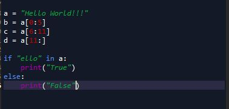
> Image of variable output:
> 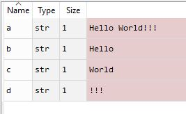
> Check if ello is in string a 
> 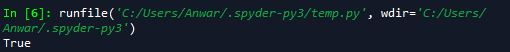

> Q. In the following code, what is the output of the print statement? Why doesn’t original_list = ['hi','how','are','you']?

> A. The print statements prints the orignial_list where there is no changes. This is because there arent any pieces of cod where we are changing this oringial list. In the second line new_list creates a copy and the rest of the code affects that copy, yet the original_list hasnt been changed.  
>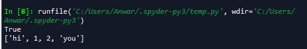

### Tutorial 2: Pyserial, Numpy

> Q. Try sending without the .encode. What happens? 

> A. It gives me the error "TypeError: 'str' object is not callable" This is caused because it returns a int. So if we input a string it gives us an error. If we convert the string to encoded, it gives us a the type bytes. 

> Q. Identify in the above code, (1) which python command prints to the python’s own console, and (2) which python command prints to the serial port to the MCU?

> A. 1) print() function prints python to its own console. 2) ser.write(S.encode('utf-8'))  prints to the MCU serial port. 

> Q. What happens if you take out the \n in the string? Why?

> A. Its not going to get outputed. In the receiveMessage function in Ardiuno, it outprints the message onto the OLED once the '\n' character has been read. If we take out this '\n' character it will keep adding the the in_text_index variable until a new line has been meet. 

### Tutorial 2: Receiving Data with Python:

> Q. Describe the output you observe on the Python side? 

> A. it outputs the time that the addtimer function is suppose to print to the serial monitor in ardiuno. 

> Q. Change the code to read 10 bytes instead of 30. Now what do you get? What are the 10 bytes you received? Remove decode might help you understand

> A. It gives us less output numbers because its reading less bytes. I get the values [10,11,12] with 10 bytes while if i use 30 bytes I get [89,90,91,92,93,94,95,96] which is bascially 3 times longer than the 10 bytes. The 10 bytes conisist of the integer values of 10,11,12. 

### Tutorial 2: Receiving A Byte at a Time 

> Q. Describe the output you observe on the Python side? Is it the same as before? What does this tell you about the print() function of python? 

> readSerial2 prints the each character in a newline because we are reading 1 byte. While readSerial3 prints the whole list because we are appending the characters into a empty list and then using the print function to output the list. The print function can print all data types like lists and integers. 

### Tutorial 2: Knowing when to quit

> Q. We purposely made a few errors above. What were they? 

>  A. the Try keyword is lowercase t. so its try:

### Tutorial 2: Numpy

Numpy Array:
> Q. Show the code - Make an Numpy Array called test_array  from a list = [0,10,4,12]. Subtract 20 from the test_array, what do you get? What is the shape of the test_array

> A.
> 
>CODE:
> 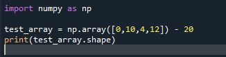
>  
> OUTPUT:
> 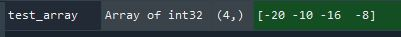

> Q. Show the code - Make a 2D array of test_2D_array from [0,10,4,12][1,20,3,41]

> A.
> 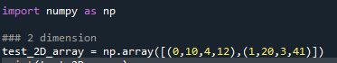

Zeros and Ones:
> Q. Make a 2D array of zeros with shape of 10x20 and then print it out

> A.
> 
> CODE:
> 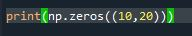
>  
> OUTPUT:
> 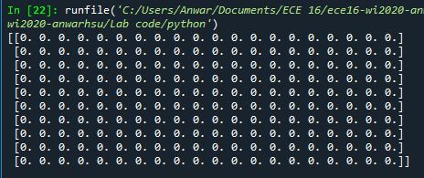

hstack and vstack:
> Q. Show the code - Out of the test_array, create the following using hstack and vstack.

> A.
> 
> CODE:
> 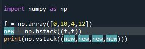
>  
> OUTPUT:
> 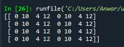

arange:
> Q. Show the code - Using arange, make an array called arange_array1 to equal [-3, 3,9,15] and arange_array2 to equal [ -7,  -9, -11, -13, -15, -17, -19]

> A.
> 
> CODE:
> 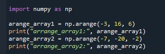
>  
> OUTPUT:
> 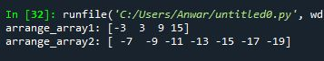

linspace:
> Q. Make an array call linspace_array using linspace that goes from 0 to 100 with 49 steps. 

> A.
> 
> CODE:
> 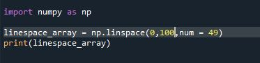
>  
> OUTPUT:
> 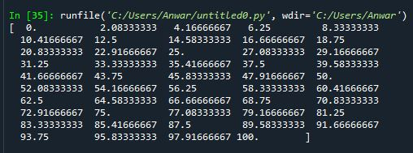

> Q. How does linspace and arange differ? When might you use one over the other?

> A. The linepsace will increment based on how many step sizes you want. It will evenly divide the start and end values by how many step sizes and even use floating point accuracy. While if we use arrange. We are in control by how much we increment each step from start to finish. The benfit to using the linspace would if you don't know the divisional increments while the arrange is good if you do know how much your incremnts are going to be. 

Indexing and slicing
> Q. What is an array of size 3x4 that would produce the following results. Show your work on how you deduced your answer on paper or some kind of graphics :

> A. 
>
> 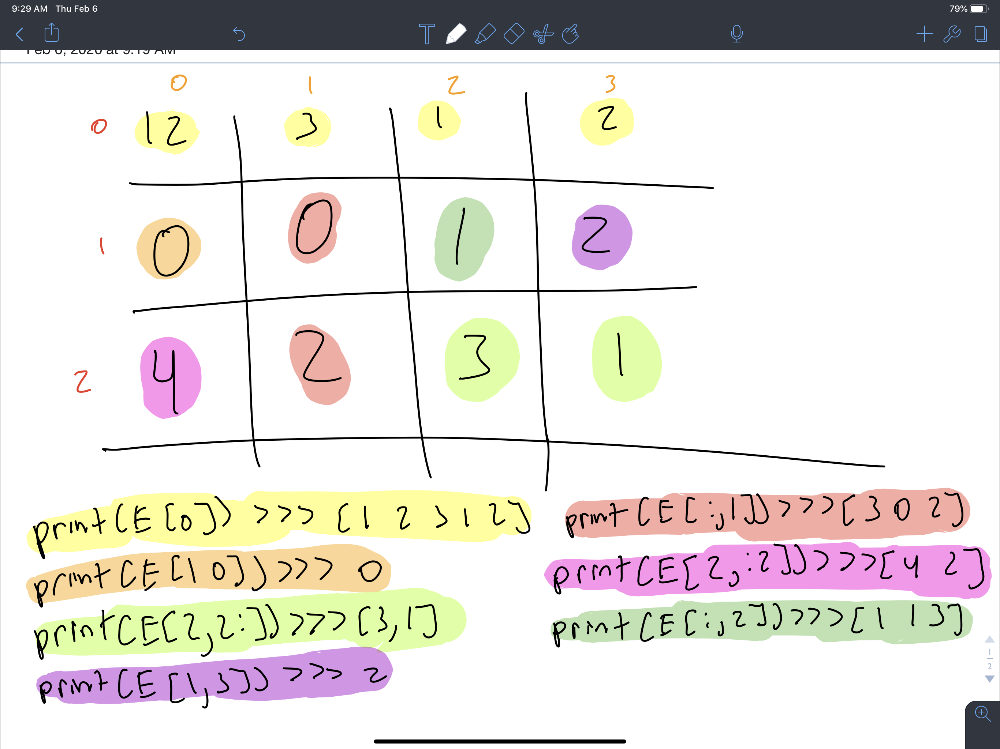

> Q. Show your code - Now solve the above indexing and slicing problem by writing the code using array assignment. 

> A.
> 
> CODE:
> 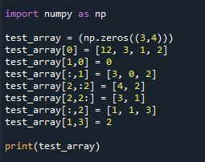
>  
> OUTPUT:
> 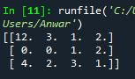

> Q. Using fromstring, vstack, and a for loop, create an array of 100x4 from s: [[1,2,3,4],[1,2,3,4],[1,2,3,4]…..[1,2,3,4]]. 

> A.
> 
> CODE:
> 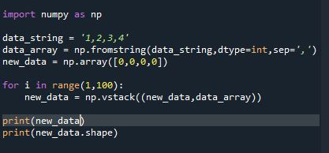
>  
> OUTPUT: I didn't include the 100 repeating array of [1,2,3,4] because it wouldn't fit. I just outputed the dimensions of the aray at the bottom whihc is 100x4
> 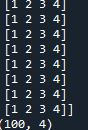

## Challenges 

### Challenge 1: Setting Your Watch to Send Data
We are making an ardiuno program that would check to see if you input "start data" into the serial monitor. Once this is checked, it thens reads the acclerometer data and outputs the data/ time it takes to read it. Once we input "Stop Data" it stops the readings. 

> Video of the ardiuno code working when we input start data and stop data 
>

### Challenge 2: Reading Accelerometer Data
We are creating a function that can read the incoming data sent from the Serial monitor to pythonb. We then also explore using the idea of using the a test case. 

> CODE:
>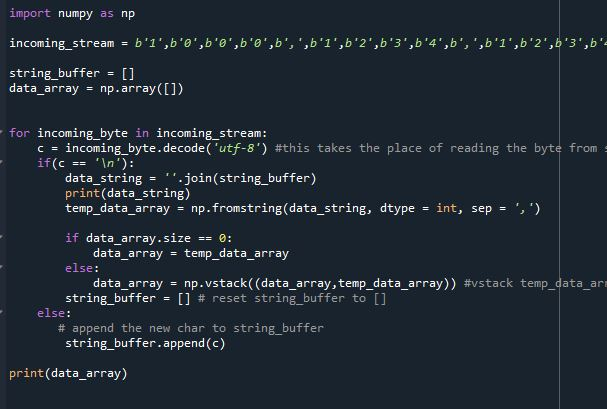
> OUTPUT:
>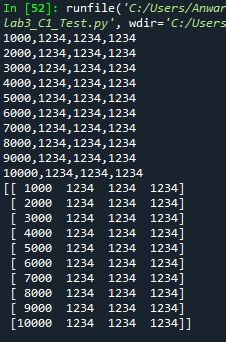

> Q. What happens if you don’t decode the incoming char?

> A. The code cant read the incoming chars because it can only read bytes. The input without the decode is a tuple getting the indexs by a for loop(baiscally not a byte).  

> Q. Try removing the logic for checking if the data_array is empty and always vstack even if the data_array is empty. What is the error that gets thrown? Why?

> A. We get the error "all the input array dimensions for the concatenation axis must match exactly, but along dimension 1, the array at index 0 has size 4 and the array at index 1 has size 7." This is casued because each newline character, it would add from the last ones. For example, if we were to look at what the 2nd row would look like, its 1000,1234,1234,1234,2000,1234,1234,1234 instead of just priting 2000,1234,1234,1234. Its keeps stacking as we get to the next row, which then causes a dimension error as we are trying to vstack with missing columns. 

> Q. Try removing the 1 second delay on the MCU when starting data sending. Describe what happens?

> A. Since the delay is removed, The MCU immeditayely sends data to the serial. port. These first few bytes might not get read so it causes the data to be different than expected. 

### Challenge 3: Calculate the Sampling Rate:
We trying to recieve the data via python and send our serial input as well. 

> Below is the expected ouput of 100 data sets. The sampling rate is then outputed. 
> 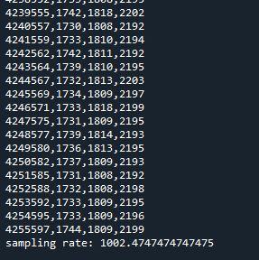

> Q. Start with Baud rate of 115200. What is your calculated sampling rate when you set the sampling rate to 10Hz,50Hz,100Hz,1000Hz on the MCU. Make a plot (using a spreadsheet program) of the actual sampling rate (y-axis) vs expected sampling rate (x-axis)

> A. There is a slight delay from the actual sampling to expected because the machine has some slight delay when running each line of code. We can see however, as sample frequency goes up, the less accurate the actual results(as shown by the 1000hz rate with almost double the expected frequency value if 1971 compare to 1000). This is cause by the machine not being able to keep up with the speeds. A solution to this would be increaseing the baud rate which would make the MCU read faster. explored in the next question 
> 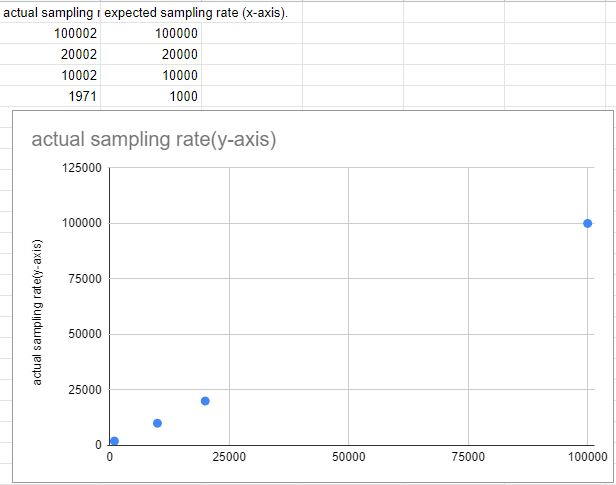

> Q. How does this change with Baud rate 9600 vs 115200 vs 230400 vs 460800. For 1000Hz, make a plot of the actual sampling rate (y-axis) vs Baud Rate (x-axis).

> A. As, we can see, when we increases the Baud rate, the accuracy of the actual sampling rate vs expected rate becomes better. We can see betwwen 115200 vs 230400. As we double the baud rate it made the sampling rate 1002. Which is close to the expected value of 1000. This increase makes sense because the MCU is reading the data faster and thus giving us accurate results. 
> 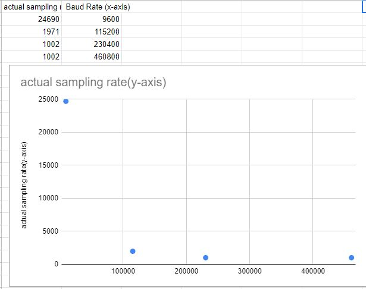

> Q. What happens if you use millis instead of micros for timing and Why?

> A. The caculation would be wrong. This is because we made our function revolve around the micros() for example. For the calcSamplingDelay function. We did 1million/sample_rate. This 1million is used because we are working in micro seconds. If we did this formula with millis. The units are wrong, and the cacluation would be wrong. 

### Challenge 4:
We are using the bluetooth option to recieve data wirelessly. 

> 