# ECE 16 Lab 4 report 
By: Anwar Hsu A15443752

Date: 02/13/2020

## Tutorial 

### MAX30105 Pulse Sensor:

> Q. Note that you can connect both the heart rate sensor and your OLED at the same time, both of which use the I2C SDA and SCL lines. Why does this work?

> A. The I2C protocol allows you to pick which slave device you want. Since we only have one SDA and SCL line we just need to wire each device SDA and SCL line in parallel. The SDA and SCL lines behave independtly. 

> Q. Notice the while(1) statement. What happens if the device is not connected? What happens if the error is printed and then you connect the device? Will the code proceed? Try it and describe the behavior.

> A. If the device is not connected it prints the error meesage "MAX30105 was not found. Please check wiring/power." If you try and connect the device after this error meassage, it wouldn't work because the while(1) statement is blocking from allowing other actions to happen. 

> Q. what would the settings look like if you were to: set the led brightness to 25mA, use only the Red + IR LED, Sample at 200Hz, and use an ADC range of 8192? 

> A. compared to the ledbirghtness 0x1F, it gets brighter as we increase the current, the voltage increases. We do't change the pulse width so having a faster sampleRate and higher ADC wouldn't have any effect becuase higher DC and sampling rate effect resoltuion rather than brightness. 

> Q. What are the units of the pulse width? Would the bigger the pulseWidth result in a more intense or less intense measurement? Why?

> A. The units of pulse width is the amount of time it takes to send each pulse signal(unit of seconds). the bigger pulseWidth would increase the intesity because the longer the voltage gets amplitfiled the brighter the led would be. 

> Q. How many bits are needed for an ADC range of 16384?

> A. 2^x = 16384. If we take log base two into a calculator, we get 14 bits. Therefore we need a 14 bit ADC. 

> Q. What is the peak wavelength of the R, IR, and G LEDs?

> A. For red its 670nm, IR is 900nm and Green is 545nm 

> Q. If you want to read the Green value, what Mode do you need the setting to be in and what function will you need to use to get the green signal?

> A. I need to be in mode 3 as it inclues RE+ IR + Green led. Instead of the getIR function, I would use getGreen instead. 

### Matplotlib

> Q. What was plotted? What does this tell you about how plt.plot interprets the input? Remember that a = [1, 2, 3, 4 ]
                                [1, 4, 9,16]

> A. The first array of [1,2,3,4] is the initale points as showed by the red line starting at 4 green at 3, orange at 2, blue at 1. The second array[1,4,9,16] plots the next point when x gets incremented by one and plots the y axis(as shown below). 
>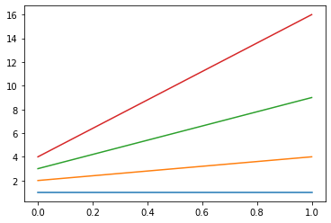

> Q. Try your best to replicate the above plot by shaking your accelerometer. The above was sampled at 50Hz for 10 seconds. Make a gif of you running your program, shaking your accelerometer, and a plot showing up similar to the one above.

> A. 

> Q. What is approximately the frequency of oscillation of the x axis signal in the plot above? 

> A. There about 4 cycles in the time frame around 2 seconds. Period would be 2 / 4 = .5 seconds. Frequency of oscillation would be 1/.5 = 2hz 

### Detrending a Moving Average 

> Q. Try different n_avg and document, with plots, the result for a few different n_avg and describe which n_avg worked well in emphasizing the taps? 

> A. 
> As we increase n_avg we can see the graph somothing out as shown for 20 vs 3. This makes the higer n_avg have a better image as there is less nose and makes it easier to differentiate the taps. 
>
> n_avg = 3 
> 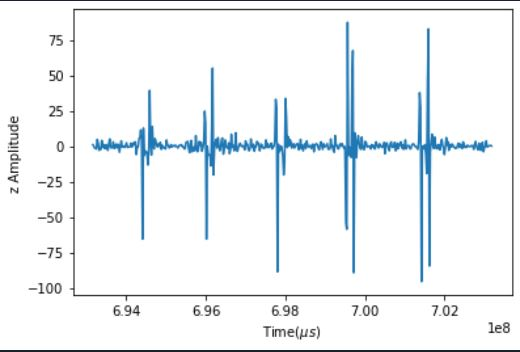
> 
> n_avg = 5 
> 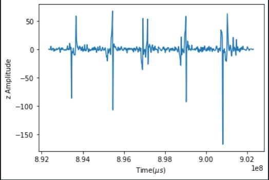
>
> n_avg = 10
> 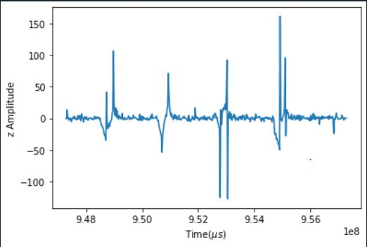
>
> n_avg = 20
> 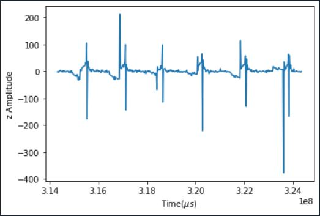

> Q. Try using np.diff(s) to calculate the gradient of the signal s and plot the signal. 

> A. 
> the graph has a similar image to the detreding function. 
> 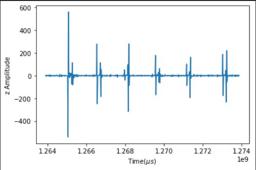
## Challenges

### Challenge 1:
This portion we are trying to understand the particle sensor and use ardiuno to get data and graph the data onto the python side

> Q. Why do we plot the negative of the signal? This has to do with light absorption. We talked about it in class. 

> A. Since there is blood, it blocks the light, therefire there is less light when the blood is pumped(less light = negative signal). 

> Q. Try different sampleAverage parameters and plot them. What is the effect of sampleAverage on the smoothness of the signal? 

> A. As we increase the sampleAverage, we get less noise and a better image of what is expected. As we we can see the as we increase the n to around 20, it looks more like a heart rate reading that is expect vs the n = 5 which looks off. The trade off is if we want speed vs resolution because a higher sampeAverage will decrease the expected freqnecy and decrease the speed vs if we have a smaller sampleAverage making our graph look better. 
>
> Sample: n = 5
> 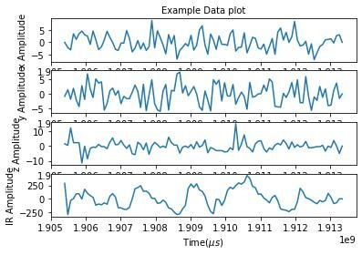
>
> Sample: n = 10
>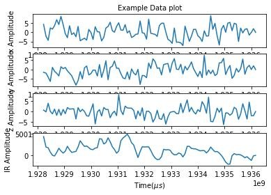
>
> Sample: n = 20
>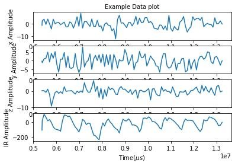

> Q. Try different ledBrightness. Is brighter always better? Why or why not.

> A. 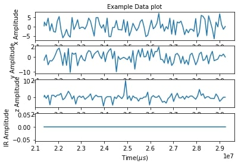
> As we can see, I maxed out the brightness. It shows us flatlining. This is caused because the the LED is too bright so the reflection that the blood reflects is insiginifcant as there is no change in IR reading. 

> Deliverable: Tune the settings so that you ultimately get a sampling rate of 50Hz. What setting did you land on that gave you a clean signal and at the right sampling rate? Show a gif of you starting your code, and end with the plot appearing. Also include a still image of the plot. 

> The closest I got to getting 50hz was 45hz. I tunned the settings in the ardiuno side to configure less samples to avoid longer delays. However, theres a trade off between getting clear vs speed results. 
> 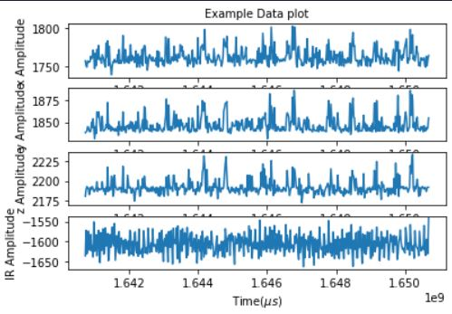
> A. 

### Challenge 2: Heart Rate Calculation

> Q. Note that it is very important to normalize AFTER you’ve done the filtering. Try normalizing before filtering and describe what happens and why it doesn’t work for helping with our threshold. 

> A. If we normalize first it dosen't get rid of high frequency reposne that we are trying to get rid of. After we apply the detrend after normalize, it shifts the cleans the normaliztion data. However, this is not the correct appoarch because we are trying to normalize the final data after we get rid of the high frqeuncy. These two options will give use completly different reuslts and thus wont let use use our threshold. 

> Q. What threshold did you find to work well and how did you determine it? 

> A. I find that the min is good around 800 as most of my data dosen't go below 0 when normalized. The max, it varies from the range 800-1200 however I mostly use 1000. Sometimes I changed if the the data dosen't like 1000. 

> Q. Show a scatter plot of your heart rate calculation (y axis) vs the heart rate of the reference. Calculate the Root Mean Squared Error (RMSE) of your detected heart rate vs the reference heart rate. RMSE is calculated as the square root of the mean of the square of the difference between your estimated heart rate and the reference heart rate. More about RMSE can be found here: https://towardsdatascience.com/what-does-rmse-really-mean-806b65f2e48e.

> A. 
> caculated vs actual graph:
> 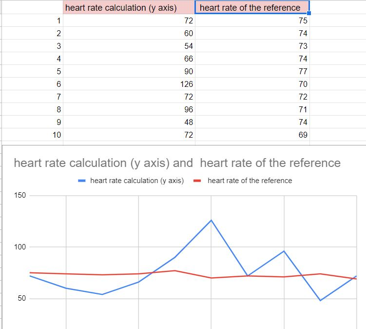
> RMSE:
> 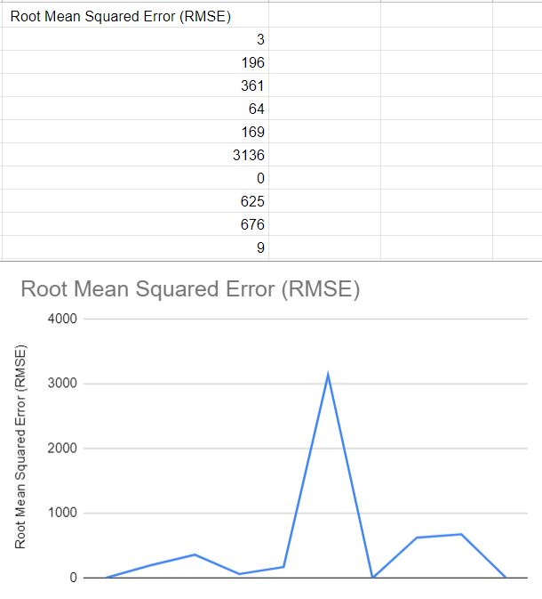

### Challenge 3 : Object Oriented Programming Restructuring
We are trying organize our challenge 1/2 code into OOP. 

> Q. We made a few mistakes in the above code, identify them and fix them. :)

> A. The init function in data dosent have parameters so i added self and data_array. Add_data function is missing the self parameter. There are probably more but i Lost track of the mistakes and have a working solution(limited on time to locate these mistakes). 

> Q. Now add a new module in Libraries called HR.py for the heart rate and signal processing methods we made in this lab. And then in the Wearable.py, add the code to calculate heart rate and print out the heart rate. Show in a gif capturing the pulse for 10 seconds, plot and print out the calculated heart rate. 

> A. 
> output:
>
>  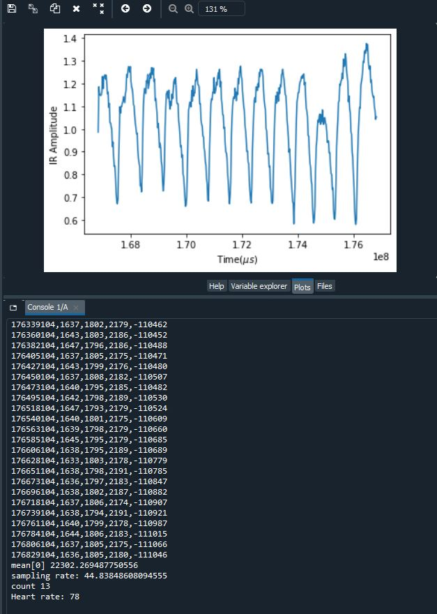
>
> Video:
>