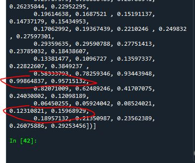
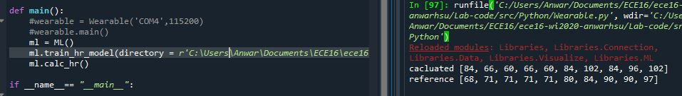

# ECE 16 Lab 5 report 
By: Anwar Hsu A15443752

Date: 02/29/2020

## Tutorial 

### Tutorial Correlation and Bland-Altman Plot :
> Q. Which metric (R,RMSE,STD,Bias) do you use to look at each of the four key analysis?

> A. Accuracy = RMSE, Precision = STD, Bias = Bias, Correlation = R 
>
> 

> Q. Using the above code, plot the correlation and bland-altman plot of your lab 4 HR estimation vs the reference. What is your R value, bias, and 95% limits of agreement

> A. R value is .33, Bias = 2, top STD = 30.15, bottom STD = 0.3

> Q. Sketch the correlation plot that would give you an R of 0. What does an R of 0 mean?

> A. 

> Q. Sketch a scatter plot of the correlation and bland-altman plot if your estimation was perfect every time. What would be the R, RMSE, Bias, and STD value of a perfect estimator?

> A. 

> Q. How might we use the 1.96STD mark to assess if a given estimate might be an outlier?

> A. If the points are outside the range of the top/ bottom STD range. In my graph we can we theres three points below the green line(bottom STD).

> Q. What would your Bland-Altman plot look like if your algorithm always guessed 70BPM regardless of the actual heart rate? Describe some prominent features about the graph beyond just showing it. 

> A. the points near 70 BPM will more likey fall in the BPM range(depends on what reference HR range you have). The points in the correlation graph would also we a horizontal line at the y axis of 70. So the further the reference the more likey its going to be an outlier. 

### Tutorial Frequency Domain:

> Q. If your sampling rate was 120Hz, what would be your maximum frequency (the Nyquist frequency)?

> A. 60 because 1/2 of the sampling frequency(120hz) = 60hz(Nyquist frequency)

> Q. If your signal bandwidth is composed of 0-10Hz, what is your minimum sampling rate to capture this signal based on the Nyquist sampling theorem? What would be recommended in general practice however?

> A. In theory our minimum sampling rate would be 20Hz(2times the sampling rate). However, in pratice, the we doint have perfect ideal filters in the real world, thus causing noise so its best to sample 4 times the sampling rate which would be 40hz. 

### Tutorial Baseline DC Signal:

> Q. How does your detrend function modify the frequency content of the signal? Show the plot and circle the part that is most modified and explain why.

> A. Its still the same frequency gprah because the detrend fucntion only moves the baseline to zero. However our DC value changes becuase detrend creates a new baseline. This is why we see a differenct DC value as shown by the circles. 
> 

### Dominant Frequency Component:

> Q. Show the code - Use np.argmax to find the actual dominant frequency of the x acceleration (currently labeled as 1Hz in the above plot). The aim here is to use argmax to get the index of the maximum value of Pxx and then use that index to get the corresponding frequency in the Freqs array. Try this with and without removing the DC offset. What do you get?

> A. If I don't remove the DC offset, it gives me index 0 because the maxium is at zero when it starts. In last Tutorial, the first graph shows with the dc offset which shows it initaliy is peaking. In the second graph we can see it gradually peaking and thus, we get the maxium frequncy was 1.8. This make sense becuase in the second graph, we can see the highest peak around 1.8 as shwon by the drawn circle. 
> 
> 

> Q. If we don’t remove the DC offset first, how can we index Pxx such that when we calculate argmax, we don’t look at the Pxx[0] (skipping the 0 index).

> A. Index one still gives us the inital 0 frequency as maxium so I went from 2 and beyond. 
> 

> Q. What is the dominant frequency for the y and z acceleration in the sample?

> A. I used the same idea as the last quesiton and found that the maxium frquency for y = 2 and z = 2
> 
> 
> 
> 

## Challenges

### Challenge 1:
We are going to compare different results of how a filter can effect the frquency domain

> 

> 
 

> Q. Looking at the documentation for signal.butter, how would you make a high pass filter with a cut off of 0.8Hz? Of the previous time based filters in Lab 4, which filter is most like the high pass filter?

> A. I would change the btype = 'high'. Similar to high pass filter would be filting out the baseline drifting because it would remove the low frequncy signals. 

### Challenge 2: What is the Frequency Content of the PPG
We are trying to find what the frequency is in our data set from lab 4

> 

> 

> Q. How does the dominant frequency change with regards to the heart rate?

> As heart rate increases, the dominat frequncys shoudl also increases. For example, if we had a heart beat of 60bpm, thats 1hz. if we had a heartrate of 120 bpm thats 2hz. 

> Q. If the heart rate is 65BPM, what is approximately the fundamental frequency? What about the second and third harmonic? Why is it that even though the heart rate is 65BPM, there are higher frequency content than just the fundamental frequency? What does this imply about how you should be setting your sampling rate if you expect a heart rate maximum of 180BPM?

> A. 65/60 = 1.083hz. The second harmonic would be 1.083 *2 = 2.166667 and third would be 1.083* 3 = 3.25. If my heartrate is 180 BPM then my fundamental frequency would be 180/60 which is 3hz. Since we want to sample x4 the expected. we would want to sample at 12hz for the heart rate. 

> Q. Compare and contrast the two different algorithms. Which has a lower error? Which has a bias closer to 0? Do you see any signs of mean tracking in either algorithm? Use the correlation and difference plots to support your argument.

> A. My sampling rate from last lab(unknown eroors) and data from lab 4 has too much noise. This has resulted in some of the resuslts as showsn by the 3.7 freq to be shown. These are the errors the the feequency domain holds. 

### Challenge 3: Calculate Heart Rate with Frequency Domain Features
We are using the idea of frquency domain and will compute an alg that would gives us the bpm

> 

> 

> Q. What are some failure modes of your frequency domain solution? 

> A. Theres little variance in terms of getting differency frequncy(less precision). It basically will give us a discrete frequncy output like 1.1hz or 1.5 hz for the next index rather than 1.12432423hz for more precision. 

> Q. Compare and contrast the two different algorithms. Which has a lower error? Which has a bias closer to 0? Do you see any signs of mean tracking in either algorithm? Use the correlation and difference plots to support your argument.

> Compared to the time domain graph. The frequency graph gives us a better r value .63 compared to .33. It seams that the frquency domain graph is better at getting in the general region(percision) however, for the time domain graph with the percise points, it gives us a more accurate result. 

> 

## Tutorial part 2

### Tutoiral : List all files in directory

> Q. what is the correct regex to get trial “0” for any subject given our naming convention “ID_Trial_HR.csv”. 

> A. Trial = 01 

### Challenge 4: Data for ML
We are trying to get a large data set from a directory and implement a filter for our GMM model to analyze in the next challenge 

> Q. According to the lecture, what is the recommended split between training and testing on a small dataset? 

> A. 70 percent is the training set. 15 percent is the validdation set and 15 percent is the test set.

> Q. Why is it important to split on subjects and not to treat each file as an independent sample?

> A. We splitting by subjects because we want our alg to be able to read our heartrate correctly. For our testing set, we want it to correctly read a completely new subject heartrate thus we need to be able to read through subjests. 

> The image below shows the output of a data set where theres a spike and it goes down to its baseline. The data is normalized. 
>

>
 
>

### Challenge 5:
We are using a GMM model to traing data and predict threhold values for a heartbeat

> Q. What is the difference between leave-one-out validation and leave-one-subject-out validation? Which are we doing and why is this important, and why would it be an issue if we used the other validation method given what we are building? 

> leave-one-out validation would be training all but one and cycling through all. leave one subject out splits the data into groups and leaves one group out then cycles through these groups. The purpose of this lab is for our heartrate sensor to work with different types of people. So we need to split our data into groups. This will allow the machine to train data given groups. 

> Image of what our Gmm predicted(blue graph)
> 

> Proof of working model for all 10 cases for each hold out subject.
> 

>Example of heartrate caculation 
> 

> Example of nonperfect caculation(graph sown below)
> 

> Large amount of noise so our GMM model is having a hard trouble predictiing threshold values. This could be fix with better data set because subject 05 id has bad data.
> 

### Challenge 6
We are implmenting our last challenge into an organize OOP style. We then will anayzle our test case to see if this is an accurate mdoel

> Example of testing the first 2 function in the ML class
> 

> Working solution of test case and heartrate outputs
> 

> Graph of all 10 cases for the first subject in the test case
> 

> As we can see the R value is 0.96 which shows that this GMM model is a good method in finding thresholds and thus allows us to get 
>  